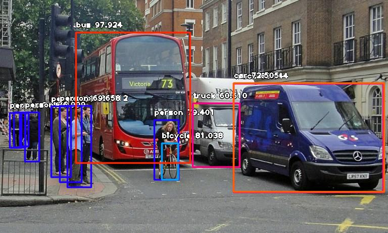
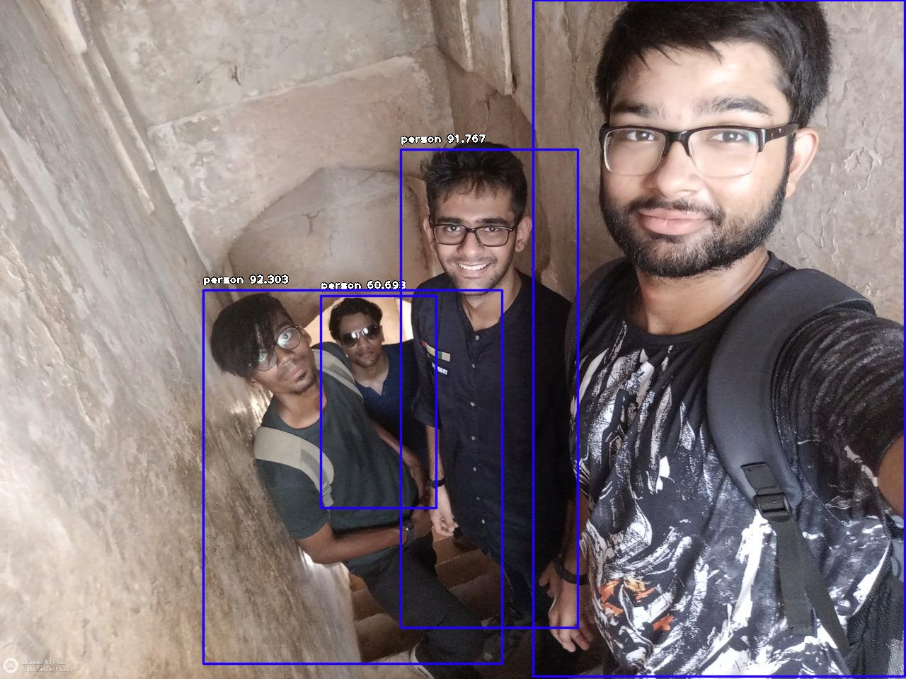

# Python-Object-Detection-with-10-lines-of-Code

* A python script using **ImageAI** library to detect objects in a given image. (only implementation)
* Saves the image locally, if it crosses a **minimum probability** threshold of 0.3

# Demos

### Example 1
Original image             |  Modified image
:-------------------------:|:-------------------------:
  |  

### Example 2
Original image             |  Modified image
:-------------------------:|:-------------------------:
  |  
